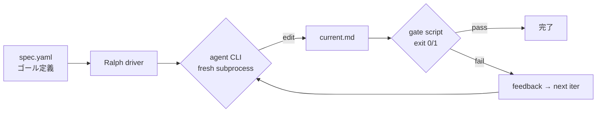
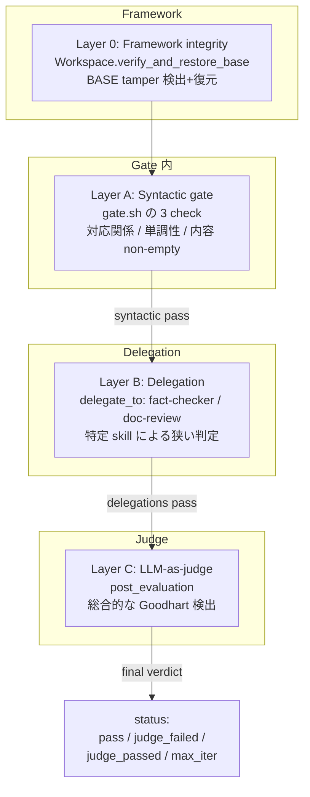
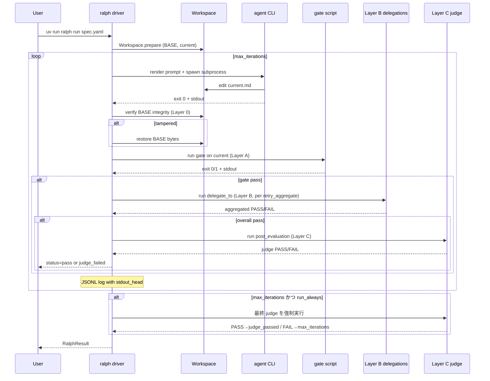
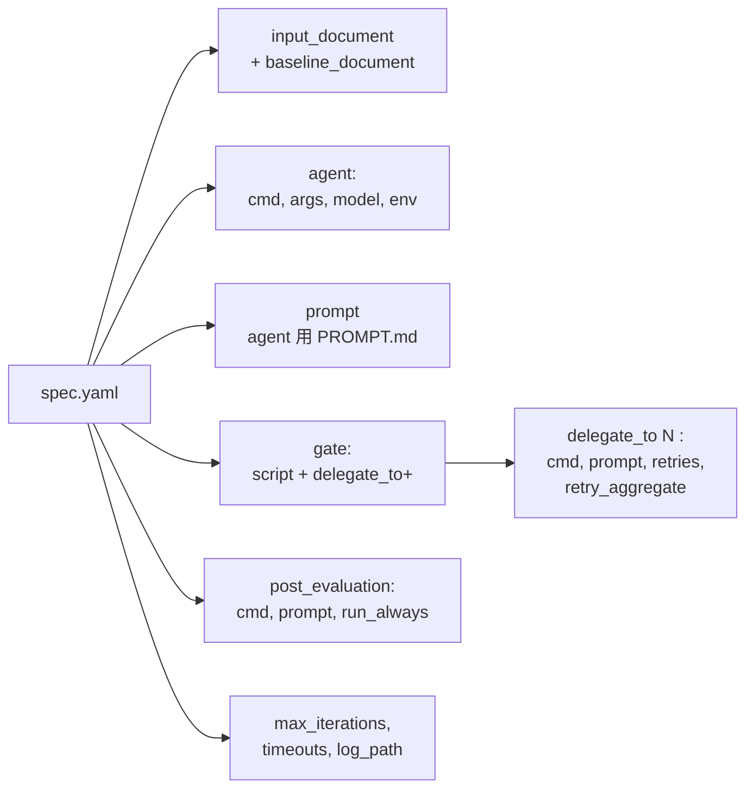
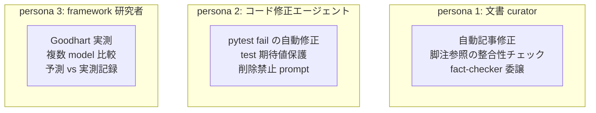
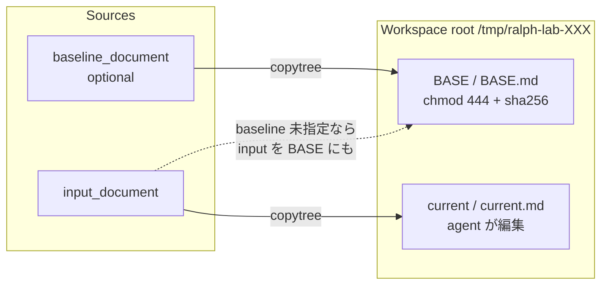

# アーキテクチャ

ralph-lab の基本コンセプトを図で把握するためのページ。

---

## 1. Ralph loop のコンセプト

**Ralph pattern**: agent CLI を fresh subprocess として繰り返し起動、
gate script による外部判定で「完了」を決める loop パターン。

**特徴**:

- **Context 蓄積なし**: 毎 iter で agent は新規 subprocess として起動。長期 context の
  劣化 (100k+ tokens で品質低下) を回避
- **Gate 中立**: gate は任意の bash script、`loop-goal` / `pytest` / `eslint` / `grep -q` 全部使える
- **subprocess を唯一の依存点**に: LLM SDK は agent CLI 側の責任、ralph-lab は起動と JSONL 記録だけ

---

## 2. 4 層防御 (Layer 0 / A / B / C)

Ralph loop での Goodhart hack (agent が「gate は通すが実質壊れた」出力を作る) を
防ぐ多層防御を実装している。

**Layer 別カバレッジ**:

| Layer | 塞ぐ pathology | 実装 | 実測範囲 |
|---|---|---|---|
| 0 | BASE tamper (workspace 前提破壊) | `workspace.py` sha256 + tarfile snapshot | 実測起動事例なし (defense-in-depth) |
| A | 捏造 / 削除 / 内容欠如 | `gate.sh` の 3 check | ~80% |
| B | 逆向き置換 / URL なし dummy | `delegate_to[]` の fact-checker | ~15% |
| C | 迂回 / 洗練された捏造 | `post_evaluation` の LLM judge | ~5% |

「1 層で全部塞ぐ」は不可能、**4 層で 95% を目指す**設計。

---

## 3. 1 iteration の詳細フロー

**注目点**:

- **Layer 0 verify** は agent 実行直後、gate 実行直前 (agent が BASE 触っても即復元)
- **Layer B は Layer A pass 後のみ**実行 (fail-fast、cost 節約)
- **Layer C は Ralph pass 後 1 回**、`run_always: true` なら max_iter 到達時も走る
- **JSONL log** に stdout_head 込みで各 layer の結果が残る (P17 で追加)

---

## 4. spec.yaml 構造

spec.yaml が Ralph loop の設計を宣言的に決める。主な field 構造:

**必須 field**: `name`, `description`, `input_document`, `agent`, `prompt`, `gate`
**Optional**: `baseline_document`, `gate.delegate_to`, `post_evaluation`, timeouts

詳細は [usage-manual.md](usage-manual.md) の "spec.yaml 完全ガイド" 参照。

---

## 5. ユースケース

想定される 3 種の user persona と代表 workflow。

### ユースケース例

| Persona | 入力 | Gate | Layer B | Layer C |
|---|---|---|---|---|
| 文書 curator | markdown article + baseline | 脚注書式 gate.sh | fact-checker + doc-review | gpt-4o judge |
| コード修正 | Python file + tests dir | `pytest` exit code | (未活用) | (未活用) |
| framework 研究者 | 実験用 fixture | 実験別 gate | 実験別 | Anthropic + OpenAI 比較 |

reference implementation: [`goals/examples/doc-verify-unified.yaml`](https://github.com/dobachi/ralph-lab/blob/main/goals/examples/doc-verify-unified.yaml)。

---

## 6. データフロー: Workspace

Workspace は 1 loop 中に共有される「作業ディレクトリ」。file / dir 両対応 (P9 で拡張)。

- **BASE**: source of truth。sha256 と bytes snapshot で integrity 保証 (Layer 0)
- **current**: agent が編集する対象。iter を跨いで累積
- **file 運用**: `BASE.md` / `current.md` 単ファイル
- **dir 運用**: `BASE/` / `current/` 全体を copytree、tarfile snapshot で hash

---

## 7. 関連 ドキュメント

- [getting-started.md](getting-started.md) — 動かすまでの最短経路
- [usage-manual.md](usage-manual.md) — spec.yaml 完全ガイド + 手順
- [knowhow/gate-design-patterns.md](knowhow/gate-design-patterns.md) — Layer A の設計
- [knowhow/gate-delegation-patterns.md](knowhow/gate-delegation-patterns.md) — Layer B/C の設計
- [knowhow/prompt-patterns.md](knowhow/prompt-patterns.md) — prompt 4 pattern
- [CONCLUSIONS.md](CONCLUSIONS.md) — 到達点と残課題
