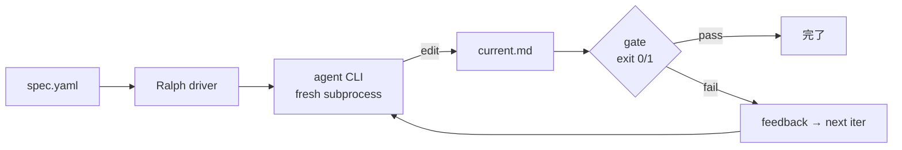

# ralph-lab

**Gate-neutral Ralph loop driver** — 任意 agent CLI × 任意 gate script で
Ralph pattern の loop を回す subprocess-based driver。

---

## このサイトの読み方

上部のタブから **目的別**に選んでください:

- :material-account: **[ユーザー向け](for-users.md)**

    ---

    ralph-lab を **使う** 人向け。動かすまでの手順、spec.yaml の書き方、
    トラブルシュート。

    ---
    始めるなら → [Getting Started](getting-started.md)

- :material-tools: **[開発者向け](for-developers.md)**

    ---

    ralph-lab を **拡張・改造・貢献する** 人向け。ノウハウ集、設計判断、
    総括、提案。

    ---
    深掘りするなら → [Knowhow index](knowhow/README.md)

- :material-flask: **[研究ログ](for-research.md)**

    ---

    予測 → 実測 の記録 (P4-P26)、Ralph landscape 調査、progress marker
    (BACKLOG)。

    ---
    実測の全貌 → [BACKLOG](01-BACKLOG.md)

---

## Ralph pattern とは

**Ralph loop**: agent CLI を fresh subprocess として繰り返し起動、
gate script による外部判定で「完了」を決めるパターン。

**特徴**:

- **Context 蓄積なし**: 毎 iter で agent は新規 subprocess
- **Gate 中立**: `loop-goal` / `pytest` / `eslint` / `grep -q` 何でも
- **subprocess を唯一の依存点**に: LLM SDK は agent CLI 側の責任

概念の詳細は [Architecture](architecture.md) を参照。

---

## 現状 (2026-09-07)

- **Alpha status** (P26 完了、reference implementation あり)
- 4 層防御 (Layer 0 / A / B / C) を実装
- Goodhart 4 種を 8 回観察、対策を framework 側に反映
- Prompt patterns を 4 種体系化
- 詳細は [CONCLUSIONS](CONCLUSIONS.md)

---

## Source

- GitHub: [dobachi/ralph-lab](https://github.com/dobachi/ralph-lab)
- License: MIT
