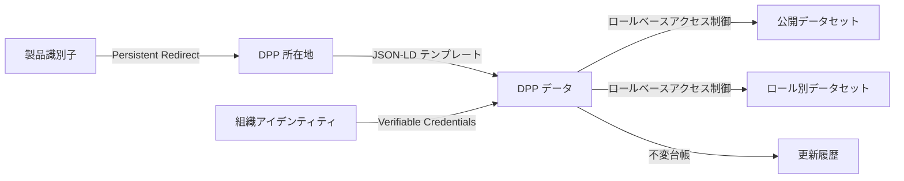

# CIRPASS-2 EU DPP 参照アーキテクチャ D4.1 — JSON-LD と VC による実装設計指針

> [← 目次に戻る](README.md)

## 概要

[[cirpass-2|CIRPASS-2]] は 2026 年 6 月 10 日に [[digital-product-passport|EU デジタルプロダクトパスポート（DPP）]] システムのドラフト参照アーキテクチャ（D4.1）を公開した。[[digital-europe-programme|Digital Europe Programme]] の資金援助を受けて CEA-List が調整機関を務めるこのコンソーシアムは、2027 年 4 月まで活動する。D4.1 は実装者向けに 6 つの設計領域を横断する 25 の推奨事項を示し、繊維・電子機器・タイヤ・建設材料の 13 パイロットで検証が進む。

## 詳細

CIRPASS-2 D4.1 が定義する参照アーキテクチャは 6 つの領域から構成される[^1]

- **相互運用性（Interoperability）**: モジュラー DPP テンプレートを伴う [[json-ld|JSON-LD]] をデフォルト交換フォーマットとして採用
- **アイデンティティ管理（Identity Management）**: 組織アイデンティティと認証済みロールに [[verifiable-credentials|Verifiable Credentials]] を使用
- **データ完全性（Data Integrity）**: 上書きではなくタイムスタンプ付き更新による不変台帳
- **アクセス制御（Access Control）**: 公開データセットとロール別データセットを分けたロールベースアクセス制御
- **製品識別（Product Identification）**: 製品識別子から現在の DPP 所在地へのリダイレクトサービス
- **ライフサイクル更新（Lifecycle Updates）**: 修理・改変が必要な製品向けのアイテムレベル識別子

参照アーキテクチャの中核に VC と JSON-LD が据えられている点は注目に値する。CIRPASS-2 D4.1 の 6 つの領域の詳細はソース 1 に基づく[^1]。

13 のライトハウスパイロットは繊維・電子機器・タイヤ・建設材料の各分野でDPPを実証試験している[^99][^2]。[[european-commission|欧州委員会]] は 2026 年 7 月 20 日に DPP レジストリの運用を開始したと発表している[^2]。

電気モーターの DPP 対応については、委任法（Delegated Act）が 2028 年以降に予定されているとされるが、欧州委員会 DPP 公式ページ[^2]には電気モーターの義務化スケジュールの明示的な記載がなく、現時点では引用元から義務化の時期を確認できない（筆者注：EC 公式ページに記載なし、情報源の追加確認を要する）。

[[espr|エコデザイン規則（ESPR）]] に基づくカテゴリ別の義務化スケジュールは、電池（2027 年 2 月 18 日）、鉄鋼（2026 年 Q4）、繊維・アルミニウム・タイヤ（2027 年 Q3-Q4）、家具（2028 年）、マットレス・ICT 製品（2029 年）という順序で展開される[^2]。

## 考察

CIRPASS-2 D4.1 が示す設計指針の最も重要な含意は、**DPP を単一の中央データベースではなく分散アーキテクチャとして設計している**点にある。製品識別子から DPP 所在地へのリダイレクトサービスと不変台帳の組み合わせは、製品のライフサイクルを通じたデータの整合性を保ちつつ、管理責任を複数のステークホルダーに分散させる設計思想を体現している。

VC によるロール認証は、サプライチェーンの上流と下流で異なる情報アクセス権を精細に制御できる仕組みを提供する。この設計は [[data-act|Data Act]] が求める「設計によるアクセス可能性」とも整合的であり、規制間の相互補完を意識した実装ガイダンスになっている。

過去記事（`reports/2026/08/24/01-eu-dpp-registry-implementing-regulation-2026-1778.md`）がレジストリの法的根拠を扱ったのに対し、D4.1 は実装者が今日から参照できる技術仕様として位置付けられる。D4.1 はまだドラフト段階であり、最終版に向けてパイロット結果を踏まえた改訂が予想される点は留意が必要だ。

## 参考文献

[^1]: wiot-group, "[CIRPASS-2 EU DPP Reference Architecture](https://wiot-group.com/think/en/news/cirpass-2-eu-dpp-reference-architecture/)", アクセス日: 2026-09-01
[^2]: 欧州委員会, "[Digital Product Passport](https://single-market-economy.ec.europa.eu/single-market/digital-product-passport_en)", アクセス日: 2026-09-01
[^99]: (補助参考情報 — パイロットプログラム詳細)

## 更新履歴

- 2026-09-01: 初版

---

> この議題にフィードバック → [Issue を作成](https://github.com/dobachi/daily-curation-reports/issues/new?labels=feedback&title=%5B2026-09-01%2F01-cirpass2-dpp-reference-architecture-d41%5D+&body=%23%23+%E5%AF%BE%E8%B1%A1%E8%A8%98%E4%BA%8B%0Areports%2F2026%2F09%2F01%2F01-cirpass2-dpp-reference-architecture-d41.md%0A%0A%23%23+%E7%A8%AE%E5%88%A5%0A-+%5B+%5D+%E8%A8%82%E6%AD%A3%2F%E8%A3%9C%E8%B6%B3%0A-+%5B+%5D+%E7%B6%9A%E7%B7%A8%E5%B8%8C%E6%9C%9B%0A-+%5B+%5D+%E6%96%B0%E3%83%88%E3%83%94%E3%83%83%E3%82%AF%E7%A4%BA%E5%94%86%0A%0A%23%23+%E5%86%85%E5%AE%B9%0A%0A)
